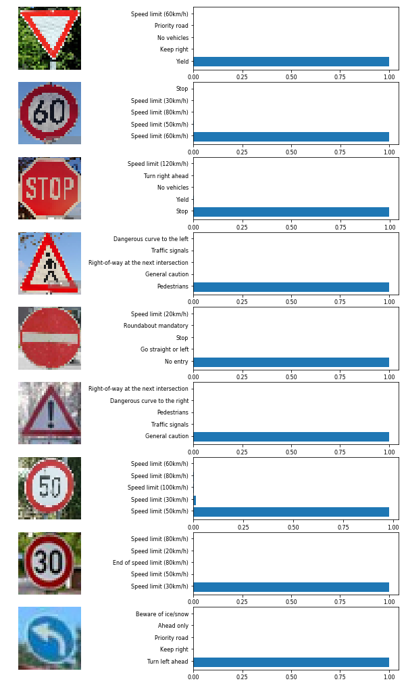

This is a project in Udacity Nanodegree for Self-driving car, forked from [CarND-Traffic-Sign-Classifier-Project](https://github.com/udacity/CarND-Traffic-Sign-Classifier-Project).


# Self-Driving Car Engineer Nanodegree

## Deep Learning

## Project: Build a Traffic Sign Recognition Classifier

This README is produced from the jupyter notebook and presents my project work on use of Deep Learning for classification of trafic signs. The readme filel is complete and, but presents only the computatinal part. You can have [the notebook](./Trafic_Sign_Classifier.ipynb) to repeat the computation or go through the [writeup](./TraficSignClassifier.pdf) for more details. If you wish to run the code, please consult [Udacity's project repository](https://github.com/udacity/CarND-Traffic-Sign-Classifier-Project) for additional information and instruction for setting up your environment such that the notebook can run properly.

---
## Step 0: Load The Data


```python
import tensorflow as tf
import numpy as np
import pandas as pd
import pickle
import glob
import cv2
import matplotlib.pyplot as plt
# Visualizations will be shown in the notebook.
%matplotlib inline

from tensorflow.contrib.layers import flatten
from sklearn.utils import shuffle
from textwrap import wrap
```

    C:\Users\DESAZAH\AppData\Local\Continuum\Anaconda3\envs\carnd-term1\lib\site-packages\sklearn\utils\fixes.py:313: FutureWarning: numpy not_equal will not check object identity in the future. The comparison did not return the same result as suggested by the identity (`is`)) and will change.
      _nan_object_mask = _nan_object_array != _nan_object_array


```python
# Load pickled data

# TODO: Fill this in based on where you saved the training and testing data

training_file = "traffic-signs-data/train.p"
validation_file= "traffic-signs-data/valid.p"
testing_file = "traffic-signs-data/test.p"
signname_file = "signnames.csv"

with open(training_file, mode='rb') as f:
    train = pickle.load(f)
with open(validation_file, mode='rb') as f:
    valid = pickle.load(f)
with open(testing_file, mode='rb') as f:
    test = pickle.load(f)

label_texts = pd.read_csv(signname_file)
    
X_train, y_train = train['features'], train['labels']
X_valid, y_valid = valid['features'], valid['labels']
X_test, y_test = test['features'], test['labels']
```

---

## Step 1: Dataset Summary & Exploration

The pickled data is a dictionary with 4 key/value pairs:

- `'features'` is a 4D array containing raw pixel data of the traffic sign images, (num examples, width, height, channels).
- `'labels'` is a 1D array containing the label/class id of the traffic sign. The file `signnames.csv` contains id -> name mappings for each id.
- `'sizes'` is a list containing tuples, (width, height) representing the original width and height the image.
- `'coords'` is a list containing tuples, (x1, y1, x2, y2) representing coordinates of a bounding box around the sign in the image.


### Basic Summary of the Data Set


```python
### Replace each question mark with the appropriate value. 
### Use python, pandas or numpy methods rather than hard coding the results

# TODO: Number of training examples
n_train = X_train.shape[0]

# TODO: Number of validation examples
n_validation = X_valid.shape[0]

# TODO: Number of testing examples.
n_test = X_test.shape[0]

# TODO: What's the shape of an traffic sign image?
image_shape = X_train[0].shape

# TODO: How many unique classes/labels there are in the dataset.
n_classes = len(np.unique(y_train))

print("Number of training examples =", n_train)
print("Number of validation examples =", n_validation)
print("Number of testing examples =", n_test)
print("Image data shape =", image_shape)
print("Number of classes =", n_classes)
```

    Number of training examples = 34799
    Number of validation examples = 4410
    Number of testing examples = 12630
    Image data shape = (32, 32, 3)
    Number of classes = 43


### Exploratory visualization of the dataset


```python
X_train, y_train = shuffle(X_train, y_train)
fig = plt.figure(figsize=(12,18))
for i in range(30):
    ax = plt.subplot(6,5,1+i)
    ax.imshow(X_train[i*550])
    ax.set_title("\n".join(wrap(label_texts.SignName[y_train[i*550]],20)), fontsize=8)
    ax.axis("off")
plt.show()
```


Some of the images are too dark. I try with equalizing them.


```python
def colorEqualize(img):
    #return cv2.cvtColor(img, cv2.COLOR_RGB2GRAY)
    return cv2.equalizeHist(cv2.cvtColor(img, cv2.COLOR_RGB2GRAY))

fig = plt.figure(figsize=(12,18))
for i in range(30):
    ax = plt.subplot(6,5,1+i)
    img_./images/output = colorEqualize(X_train[i*550])
    ax.imshow(img_./images/output,cmap="gray")
    ax.set_title("\n".join(wrap(label_texts.SignName[y_train[i*550]],20)), fontsize=8)
    ax.axis("off")
plt.show()
```


```python
def equalizeAll():
    X_train_gray = []
    X_valid_gray = []
    X_test_gray = []
    for i in range(n_train):
        X_train_gray.append(colorEqualize(X_train[i]))
    for i in range(n_validation):
        X_valid_gray.append(colorEqualize(X_valid[i]))
    for i in range(n_test):
        X_test_gray.append(colorEqualize(X_test[i]))
    return np.array(X_train_gray), np.array(X_valid_gray), np.array(X_test_gray)

X_train_g, X_valid_g, X_test_g = equalizeAll()
X_valid = X_valid_g
X_test = X_test_g
```


```python
def plot_data_statistics(data, label_texts, title):
    fig = plt.figure(figsize=(12, 12))
    hist, bins = np.histogram(data, bins=n_classes)
    x_axis = np.linspace(0,n_classes, num=n_classes)
    plt.barh(x_axis, hist)
    plt.yticks(x_axis+0.5,label_texts)
    plt.xlabel("# of images")
    plt.title(title)
    plt.show()
    return

plot_data_statistics(y_train, label_texts.SignName,"Training data")
plot_data_statistics(y_valid, label_texts.SignName,"Validating data")
plot_data_statistics(y_test, label_texts.SignName,"Test data")
```


To increase the number of images for those with low number, I zoom in and zoom out.


```python
from skimage import exposure
from skimage import util

def augmentData(original_image,label):
    X = np.zeros((4,32,32),dtype=np.uint8)
    Y = np.zeros(4,dtype=np.uint8) + label
    bigger_image = cv2.resize(original_image,(40,40))
    zoomed_in_image = bigger_image[5:37, 5:37]
    smaller_image = cv2.resize(original_image,(28,28))
    blured_image = cv2.GaussianBlur(original_image,(15,15),0)
    zoomed_out_image = blured_image.copy()
    zoomed_out_image[2:30, 2:30] = smaller_image
    image_with_random_noise = np.uint(util.random_noise(original_image)*255)
    v_min, v_max = np.percentile(original_image, (0.2, 99.8))
    better_contrast = exposure.rescale_intensity(original_image, in_range=(v_min, v_max))
    
    X[0] = zoomed_in_image
    X[1] = zoomed_out_image
    X[2] = image_with_random_noise
    X[3] = better_contrast

    return X, Y

X, Y = augmentData(colorEqualize(X_train[587]),y_train[587])

fig, ax = plt.subplots(1,5,figsize=(12,12))
ax[0].imshow(colorEqualize(X_train[587]),cmap="gray")
ax[0].axis("off")
ax[0].set_title("Original", fontsize=8)
ax[1].imshow(X[0],cmap="gray")
ax[1].axis("off")
ax[1].set_title("Zoom in", fontsize=8)
ax[2].imshow(X[1],cmap="gray")
ax[2].axis("off")
ax[2].set_title("Zoom out", fontsize=8)
ax[3].imshow(X[2],cmap="gray")
ax[3].axis("off")
ax[3].set_title("Random noise", fontsize=8)
ax[4].imshow(X[3],cmap="gray")
ax[4].axis("off")
ax[4].set_title("Contrast", fontsize=8)
```


    <matplotlib.text.Text at 0x118f2128>


```python
minImageNo = 1000
new_X_train = [] #np.array([],dtype=np.uint)
new_y_train = [] #np.array([],dtype=np.uint)
for i in range(n_classes):
    X_tmp = X_train_g[y_train==i,:,:]
    NoImages = X_tmp.shape[0]
    print(i+1,") ", NoImages, " images found for ", label_texts.SignName[i])
    if (NoImages < minImageNo):
        addedImage = 0
        j = 0
        while ((j<NoImages) and (addedImage < (minImageNo-NoImages))):
            X, Y = augmentData(X_tmp[j],i)
            for ix in range(X.shape[0]):
                new_X_train.append(X[ix])
            for iy in range(Y.shape[0]):
                new_y_train.append(Y[iy])                
            j += 1
            addedImage += X.shape[0]
        print(addedImage, " images added.")

new_X_train=np.array(new_X_train)
new_y_train=np.array(new_y_train)

print("Total number of new images is: ", new_X_train.shape[0])
print("Total number of new labels is: ", new_y_train.shape[0])
```

    1 )  180  images found for  Speed limit (20km/h)
    720  images added.
    2 )  1980  images found for  Speed limit (30km/h)
    3 )  2010  images found for  Speed limit (50km/h)
    4 )  1260  images found for  Speed limit (60km/h)
    5 )  1770  images found for  Speed limit (70km/h)
    6 )  1650  images found for  Speed limit (80km/h)
    7 )  360  images found for  End of speed limit (80km/h)
    640  images added.
    8 )  1290  images found for  Speed limit (100km/h)
    9 )  1260  images found for  Speed limit (120km/h)
    10 )  1320  images found for  No passing
    11 )  1800  images found for  No passing for vehicles over 3.5 metric tons
    12 )  1170  images found for  Right-of-way at the next intersection
    13 )  1890  images found for  Priority road
    14 )  1920  images found for  Yield
    15 )  690  images found for  Stop
    312  images added.
    16 )  540  images found for  No vehicles
    460  images added.
    17 )  360  images found for  Vehicles over 3.5 metric tons prohibited
    640  images added.
    18 )  990  images found for  No entry
    12  images added.
    19 )  1080  images found for  General caution
    20 )  180  images found for  Dangerous curve to the left
    720  images added.
    21 )  300  images found for  Dangerous curve to the right
    700  images added.
    22 )  270  images found for  Double curve
    732  images added.
    23 )  330  images found for  Bumpy road
    672  images added.
    24 )  450  images found for  Slippery road
    552  images added.
    25 )  240  images found for  Road narrows on the right
    760  images added.
    26 )  1350  images found for  Road work
    27 )  540  images found for  Traffic signals
    460  images added.
    28 )  210  images found for  Pedestrians
    792  images added.
    29 )  480  images found for  Children crossing
    520  images added.
    30 )  240  images found for  Bicycles crossing
    760  images added.
    31 )  390  images found for  Beware of ice/snow
    612  images added.
    32 )  690  images found for  Wild animals crossing
    312  images added.
    33 )  210  images found for  End of all speed and passing limits
    792  images added.
    34 )  599  images found for  Turn right ahead
    404  images added.
    35 )  360  images found for  Turn left ahead
    640  images added.
    36 )  1080  images found for  Ahead only
    37 )  330  images found for  Go straight or right
    672  images added.
    38 )  180  images found for  Go straight or left
    720  images added.
    39 )  1860  images found for  Keep right
    40 )  270  images found for  Keep left
    732  images added.
    41 )  300  images found for  Roundabout mandatory
    700  images added.
    42 )  210  images found for  End of no passing
    792  images added.
    43 )  210  images found for  End of no passing by vehicles over 3.5 metric tons
    792  images added.
    Total number of new images is:  16620
    Total number of new labels is:  16620


```python
new_X_train, new_y_train = shuffle(new_X_train, new_y_train)
fig = plt.figure(figsize=(12,18))
for i in range(20):
    ax = plt.subplot(6,5,1+i)
    ax.imshow(new_X_train[i*450],cmap="gray")
    ax.set_title("\n".join(wrap(label_texts.SignName[new_y_train[i*450]],20)), fontsize=8)
    ax.axis("off")
plt.show()
```


----

## Step 2: Design and Test a Model Architecture


### Pre-process the Data Set


```python
### Preprocess the data here. It is required to normalize the data. Other preprocessing steps could include 
### converting to grayscale, etc.
### Feel free to use as many code cells as needed.
def normaize_image(x,x_min,x_max):
    return x/255*(x_max-x_min)+x_min

X_train = np.append(X_train_g, new_X_train, axis=0)
y_train = np.append(y_train, new_y_train, axis=0)

X_train, y_train = shuffle(X_train, y_train) 

X_train = np.expand_dims(normaize_image(X_train, 0.1, 0.9), axis=3)
X_valid = np.expand_dims(normaize_image(X_valid_g, 0.1, 0.9), axis=3)
X_test = np.expand_dims(normaize_image(X_test_g, 0.1, 0.9), axis=3)
print("X_train: max= ", np.max(X_train), " min= ", np.min(X_train), "Shape: ", X_train.shape)
print("X_test: max= ", np.max(X_test), " min= ", np.min(X_test), "Shape: ", X_test.shape)
print("X_valid: max= ", np.max(X_valid), " min= ", np.min(X_valid), "Shape: ", X_valid.shape)

plot_data_statistics(y_train, label_texts.SignName,"Training data")
```

    X_train: max=  0.9  min=  0.1 Shape:  (51419, 32, 32, 1)
    X_test: max=  0.9  min=  0.1 Shape:  (12630, 32, 32, 1)
    X_valid: max=  0.9  min=  0.1 Shape:  (4410, 32, 32, 1)


### Model Architecture


```python
### Define your architecture here.
### Feel free to use as many code cells as needed.

def conv_layer(x, shape, strides, padding, name, mu=0, sigma=0.1):
    # Stride for each dimension (batch_size, height, width, depth)
    weights = tf.Variable(tf.truncated_normal(shape=shape, mean = mu, stddev = sigma), name="weight_"+name)
    biases = tf.Variable(tf.zeros(shape[3]), name="bias_"+name)
    layer = tf.nn.conv2d(x, weights, strides=[1, 1, 1, 1], padding=padding, name="conv_"+name)
    layer = tf.nn.bias_add(layer, biases, name="bias_add_"+name)
    return layer

def max_pool_layer(x, ksize, strides, padding, name):
    # Stride for each dimension (batch_size, height, width, depth)
    # ksize (filter size) for each dimension (batch_size, height, width, depth)
    layer = tf.nn.max_pool(x, ksize=ksize, strides=strides, padding=padding, name="maxpool_"+name)
    return layer

def fully_connected_layer(x, shape, name, mu=0, sigma=0.1):
    weights = tf.Variable(tf.truncated_normal(shape=shape, mean = mu, stddev = sigma), name="weight_"+name)
    biases = tf.Variable(tf.zeros(shape[1]), name="bias_"+name)
    layer = tf.matmul(x, weights, name="matmul_"+name)
    layer = tf.nn.bias_add(layer, biases, name="bias_add_"+name)
    return layer

def LeNet(x):    
    # Arguments used for tf.truncated_normal, randomly defines variables for the weights and biases for each layer
    mu = 0
    sigma = 0.1
    
    # Input = 32x32x3. ./images/output = 28x28x6.
    L_1 = conv_layer(x,   (5, 5, 1, 16), [1, 1, 1, 1], 'VALID', "1")
    L_1 = tf.nn.relu(L_1)
    # Input = 28x28x16. ./images/output = 14x14x16.
    L_1 = max_pool_layer(L_1, [1, 2, 2, 1], [1, 2, 2, 1], 'VALID', "1")
    #1) Input = 14x14x16. ./images/output = 10x10x32.
    L_2 = conv_layer(L_1, (5, 5, 16, 32), [1, 1, 1, 1], 'VALID', "2")
    L_2 = tf.nn.relu(L_2)
    #1) Input = 10x10x32. ./images/output = 5x5x32.
    L_2 = max_pool_layer(L_2, [1, 2, 2, 1], [1, 2, 2, 1], 'VALID', "2")

    #1) Input = 5x5x32. ./images/output = 800.
    L_3 = flatten(L_2)
    L_3 = tf.nn.dropout(L_3, input_keep_prob)
    
    #1) Input = 800. ./images/output = 240.
    L_3 = fully_connected_layer(L_3, (800, 240), "3") 
    L_3 = tf.nn.relu(L_3)
    L_3 = tf.nn.dropout(L_3, hidden_keep_prob)

    #1)  Input = 240. ./images/output = 120.
    L_4 = fully_connected_layer(L_3, (240, 120), "4") 
    L_4 = tf.nn.relu(L_4)
    L_4 = tf.nn.dropout(L_4, hidden_keep_prob)

    #1) Input = 120. ./images/output = 43.
    yp = fully_connected_layer(L_4, (120, 43), "out")

    return yp, L_1, L_2
```

### Train, Validate and Test the Model


```python
### Train your model here.
### Calculate and report the accuracy on the training and validation set.
### Once a final model architecture is selected, 
### the accuracy on the test set should be calculated and reported as well.
### Feel free to use as many code cells as needed.
x = tf.placeholder(tf.float32, (None, 32, 32, 1))
y = tf.placeholder(tf.int32, (None))
one_hot_y = tf.one_hot(y, n_classes)
input_keep_prob = tf.placeholder(tf.float32)
hidden_keep_prob = tf.placeholder(tf.float32)

rate = 0.001

logits, maxpool_1, maxpoo1_2 = LeNet(x)
cross_entropy = tf.nn.softmax_cross_entropy_with_logits(labels=one_hot_y, logits=logits)
loss_operation = tf.reduce_mean(cross_entropy)
optimizer = tf.train.AdamOptimizer(learning_rate = rate)
training_operation = optimizer.minimize(loss_operation)

# -----------------------------------------------

correct_prediction = tf.equal(tf.argmax(logits, 1), tf.argmax(one_hot_y, 1))
accuracy_operation = tf.reduce_mean(tf.cast(correct_prediction, tf.float32))
saver = tf.train.Saver()

def evaluate(X_data, y_data):
    num_examples = len(X_data)
    total_accuracy = 0
    sess = tf.get_default_session()
    for offset in range(0, num_examples, BATCH_SIZE):
        batch_x, batch_y = X_data[offset:offset+BATCH_SIZE], y_data[offset:offset+BATCH_SIZE]
        accuracy = sess.run(accuracy_operation, feed_dict={x: batch_x, y: batch_y, input_keep_prob: 1.0, hidden_keep_prob: 1.0})
        total_accuracy += (accuracy * len(batch_x))
    return total_accuracy / num_examples

# -----------------------------------------------

EPOCHS = 30
BATCH_SIZE = 64

with tf.Session() as sess:
    sess.run(tf.global_variables_initializer())
#    saver.restore(sess, tf.train.latest_checkpoint('.'))
    num_examples = len(X_train)
    
    print("Training...")
    print()
    for i in range(EPOCHS):
        X_train, y_train = shuffle(X_train, y_train)
        for offset in range(0, num_examples, BATCH_SIZE):
            end = offset + BATCH_SIZE
            batch_x, batch_y = X_train[offset:end], y_train[offset:end]
            x_shape = batch_x.shape
            batch_x = np.reshape(batch_x,(x_shape[0],x_shape[1],x_shape[2],1))
            sess.run(training_operation, feed_dict={x: batch_x, y: batch_y, input_keep_prob: 0.8, hidden_keep_prob: 0.5})
        print("Epoche ", i, " completed.")    
        validation_accuracy = evaluate(X_valid, y_valid)
        print("EPOCH {} ...".format(i+1))
        print("Validation Accuracy = {:.3f}".format(validation_accuracy))
        print()
        
    saver.save(sess, './lenet')
    print("Model saved")
```

    Training...
    
    Epoche  0  completed.
    EPOCH 1 ...
    Validation Accuracy = 0.800
    
    Epoche  1  completed.
    EPOCH 2 ...
    Validation Accuracy = 0.928
    
    Epoche  2  completed.
    EPOCH 3 ...
    Validation Accuracy = 0.949
    
    Epoche  3  completed.
    EPOCH 4 ...
    Validation Accuracy = 0.958
    
    Epoche  4  completed.
    EPOCH 5 ...
    Validation Accuracy = 0.964
    
    Epoche  5  completed.
    EPOCH 6 ...
    Validation Accuracy = 0.966
    
    Epoche  6  completed.
    EPOCH 7 ...
    Validation Accuracy = 0.973
    
    Epoche  7  completed.
    EPOCH 8 ...
    Validation Accuracy = 0.972
    
    Epoche  8  completed.
    EPOCH 9 ...
    Validation Accuracy = 0.975
    
    Epoche  9  completed.
    EPOCH 10 ...
    Validation Accuracy = 0.972
    
    Epoche  10  completed.
    EPOCH 11 ...
    Validation Accuracy = 0.977
    
    Epoche  11  completed.
    EPOCH 12 ...
    Validation Accuracy = 0.977
    
    Epoche  12  completed.
    EPOCH 13 ...
    Validation Accuracy = 0.979
    
    Epoche  13  completed.
    EPOCH 14 ...
    Validation Accuracy = 0.980
    
    Epoche  14  completed.
    EPOCH 15 ...
    Validation Accuracy = 0.971
    
    Epoche  15  completed.
    EPOCH 16 ...
    Validation Accuracy = 0.980
    
    Epoche  16  completed.
    EPOCH 17 ...
    Validation Accuracy = 0.979
    
    Epoche  17  completed.
    EPOCH 18 ...
    Validation Accuracy = 0.981
    
    Epoche  18  completed.
    EPOCH 19 ...
    Validation Accuracy = 0.984
    
    Epoche  19  completed.
    EPOCH 20 ...
    Validation Accuracy = 0.980
    
    Epoche  20  completed.
    EPOCH 21 ...
    Validation Accuracy = 0.982
    
    Epoche  21  completed.
    EPOCH 22 ...
    Validation Accuracy = 0.980
    
    Epoche  22  completed.
    EPOCH 23 ...
    Validation Accuracy = 0.982
    
    Epoche  23  completed.
    EPOCH 24 ...
    Validation Accuracy = 0.979
    
    Epoche  24  completed.
    EPOCH 25 ...
    Validation Accuracy = 0.981
    
    Epoche  25  completed.
    EPOCH 26 ...
    Validation Accuracy = 0.980
    
    Epoche  26  completed.
    EPOCH 27 ...
    Validation Accuracy = 0.982
    
    Epoche  27  completed.
    EPOCH 28 ...
    Validation Accuracy = 0.978
    
    Epoche  28  completed.
    EPOCH 29 ...
    Validation Accuracy = 0.983
    
    Epoche  29  completed.
    EPOCH 30 ...
    Validation Accuracy = 0.981
    
    Model saved


```python
with tf.Session() as sess:
    saver.restore(sess, tf.train.latest_checkpoint('.'))

    test_accuracy = evaluate(X_test, y_test)
    print("Test Accuracy = {:.3f}".format(test_accuracy))
```

    INFO:tensorflow:Restoring parameters from .\lenet
    Test Accuracy = 0.948


---

## Step 3: Test a Model on New Images


### Load and ./images/output the Images


```python
### Load the images and plot them here.
### Feel free to use as many code cells as needed.
test_images = glob.glob('GTSC_test_images/*.jpg')
test_images_label = [13, 3, 14, 27, 17, 18, 2, 1, 34]

imgs = []
for img_file in test_images:
    imgs.append(plt.imread(img_file))

fig,ax = plt.subplots(2,len(imgs),figsize=(12,6))
for i in range(len(imgs)):
    ax[0,i].imshow(imgs[i])
    ax[0,i].axis("off")
    ax[0,i].set_title("\n".join(wrap(label_texts.SignName[test_images_label[i]],15)), fontsize=10)
    imgs[i] = cv2.resize(imgs[i],(32,32))
    ax[1,i].imshow(imgs[i])
    ax[1,i].axis("off")
    ax[1,i].set_title("\n".join(wrap(label_texts.SignName[test_images_label[i]],15)), fontsize=10)
```


### Predict the Sign Type for Each Image


```python
### Run the predictions here and use the model to ./images/output the prediction for each image.
### Make sure to pre-process the images with the same pre-processing pipeline used earlier.
### Feel free to use as many code cells as needed.

X = np.zeros((len(imgs),32,32))
for i in range(len(imgs)):
    X[i,:,:] = normaize_image(colorEqualize(imgs[i]), 0.1, 0.9)
X = np.expand_dims(X,axis=3)
    
tf.reset_default_graph()

x = tf.placeholder(tf.float32, (None, 32, 32, 1), name="x")
y = tf.placeholder(tf.int32, (None), name="y")
input_keep_prob = tf.placeholder(tf.float32, name="input_keep_prob")
hidden_keep_prob = tf.placeholder(tf.float32, name="hidden_keep_prob")


one_hot_y = tf.one_hot(y, 43)

logits, maxpool_1, maxpool_2 = LeNet(x)
pred = tf.nn.softmax(logits)
pred_label = tf.argmax(pred, 1)

# Add ops to save and restore all the variables.
saver = tf.train.Saver()

with tf.Session() as sess:
    saver.restore(sess, './lenet')

    nn_pred = sess.run(pred, feed_dict={x: X, input_keep_prob: 1.0, hidden_keep_prob: 1.0})
    found_label = sess.run(pred_label, feed_dict={pred: nn_pred, input_keep_prob: 1.0, hidden_keep_prob: 1.0})
    yk_prob, yk_pred = sess.run(tf.nn.top_k(pred, k=5), feed_dict={pred: nn_pred, input_keep_prob: 1.0, hidden_keep_prob: 1.0})

fig = plt.figure(figsize=(12,18))
for i in range(len(imgs)):
    plt.subplot(9, 2, 2*i+1)
    plt.imshow(imgs[i])
    plt.axis("off")
    plt.subplot(9, 2, 2*i+2)
    plt.barh(np.arange(1, 6, 1), yk_prob[i, :])
    plt.xticks(np.linspace(0, 1, 5), fontsize=8)
    plt.yticks(np.arange(1, 6, 1)+0.5, [label_texts.SignName[j] for j in yk_pred[i]], fontsize=8)

```

    INFO:tensorflow:Restoring parameters from ./lenet





### Analyze Performance


```python
### Calculate the accuracy for these 5 new images. 
### For example, if the model predicted 1 out of 5 signs correctly, it's 20% accurate on these new images.

total_accuracy = 0
numb_images = len(imgs)
for i in range(numb_images):
    if (yk_pred[i,0] == test_images_label[i]):
        total_accuracy += 1/numb_images
print("Prediction accuracy for {0:2d} images was {1:2.2f}%.".format(numb_images, total_accuracy*100))
```

    Prediction accuracy for  9 images was 100.00%.


### ./images/output Top 5 Softmax Probabilities For Each Image Found on the Web

For each of the new images, print out the model's softmax probabilities to show the **certainty** of the model's predictions (limit the ./images/output to the top 5 probabilities for each image). [`tf.nn.top_k`](https://www.tensorflow.org/versions/r0.12/api_docs/python/nn.html#top_k) could prove helpful here. 

The example below demonstrates how tf.nn.top_k can be used to find the top k predictions for each image.

`tf.nn.top_k` will return the values and indices (class ids) of the top k predictions. So if k=3, for each sign, it'll return the 3 largest probabilities (out of a possible 43) and the correspoding class ids.

Take this numpy array as an example. The values in the array represent predictions. The array contains softmax probabilities for five candidate images with six possible classes. `tf.nn.top_k` is used to choose the three classes with the highest probability:

```
# (5, 6) array
a = np.array([[ 0.24879643,  0.07032244,  0.12641572,  0.34763842,  0.07893497,
         0.12789202],
       [ 0.28086119,  0.27569815,  0.08594638,  0.0178669 ,  0.18063401,
         0.15899337],
       [ 0.26076848,  0.23664738,  0.08020603,  0.07001922,  0.1134371 ,
         0.23892179],
       [ 0.11943333,  0.29198961,  0.02605103,  0.26234032,  0.1351348 ,
         0.16505091],
       [ 0.09561176,  0.34396535,  0.0643941 ,  0.16240774,  0.24206137,
         0.09155967]])
```

Running it through `sess.run(tf.nn.top_k(tf.constant(a), k=3))` produces:

```
TopKV2(values=array([[ 0.34763842,  0.24879643,  0.12789202],
       [ 0.28086119,  0.27569815,  0.18063401],
       [ 0.26076848,  0.23892179,  0.23664738],
       [ 0.29198961,  0.26234032,  0.16505091],
       [ 0.34396535,  0.24206137,  0.16240774]]), indices=array([[3, 0, 5],
       [0, 1, 4],
       [0, 5, 1],
       [1, 3, 5],
       [1, 4, 3]], dtype=int32))
```

Looking just at the first row we get `[ 0.34763842,  0.24879643,  0.12789202]`, you can confirm these are the 3 largest probabilities in `a`. You'll also notice `[3, 0, 5]` are the corresponding indices.


```python
### Print out the top five softmax probabilities for the predictions on the German traffic sign images found on the web. 
### Feel free to use as many code cells as needed.
print(yk_prob)
```

    [[  1.00000000e+00   1.09714737e-09   7.57066354e-11   1.05987745e-11
        1.82904798e-12]
     [  9.98292029e-01   1.66172988e-03   2.07776047e-05   1.34593438e-05
        5.52068650e-06]
     [  9.97072101e-01   2.57776096e-03   1.43788973e-04   6.93244292e-05
        2.85145215e-05]
     [  9.99998212e-01   1.22587664e-06   4.78987317e-07   3.57038843e-08
        2.53546197e-08]
     [  9.99999881e-01   1.66010679e-07   3.17817417e-08   7.71205588e-09
        3.69159281e-09]
     [  1.00000000e+00   7.89578472e-13   1.06298737e-18   6.16569604e-21
        9.69454832e-24]
     [  9.79885280e-01   1.17385779e-02   4.83282609e-03   3.23729310e-03
        8.83075263e-05]
     [  9.99948859e-01   5.09991805e-05   1.72036167e-07   5.51405188e-09
        4.80093409e-10]
     [  1.00000000e+00   1.17550174e-27   1.19980669e-28   4.28367407e-30
        1.56455477e-30]]


---

## Step 4: Visualize the Neural Network's State with Test Images

 


```python
### Visualize your network's feature maps here.
### Feel free to use as many code cells as needed.

# image_input: the test image being fed into the network to produce the feature maps
# tf_activation: should be a tf variable name used during your training procedure that represents the calculated state of a specific weight layer
# activation_min/max: can be used to view the activation contrast in more detail, by default matplot sets min and max to the actual min and max values of the ./images/output
# plt_num: used to plot out multiple different weight feature map sets on the same block, just extend the plt number for each new feature map entry

def ./images/outputFeatureMap(image_input, tf_activation, activation_min=-1, activation_max=-1 ,plt_num=1):
    # Here make sure to preprocess your image_input in a way your network expects
    # with size, normalization, ect if needed
    # image_input =
    # Note: x should be the same name as your network's tensorflow data placeholder variable
    # If you get an error tf_activation is not defined it may be having trouble accessing the variable from inside a function
    activation = tf_activation.eval(session=sess,feed_dict={x : image_input})
    featuremaps = activation.shape[3]
    plt.figure(plt_num, figsize=(15,15))
    for featuremap in range(featuremaps):
        plt.subplot(6,8, featuremap+1) # sets the number of feature maps to show on each row and column
        plt.title('FeatureMap ' + str(featuremap)) # displays the feature map number
        if activation_min != -1 & activation_max != -1:
            plt.imshow(activation[0,:,:, featuremap], interpolation="nearest", vmin =activation_min, vmax=activation_max, cmap="gray")
        elif activation_max != -1:
            plt.imshow(activation[0,:,:, featuremap], interpolation="nearest", vmax=activation_max, cmap="gray")
        elif activation_min !=-1:
            plt.imshow(activation[0,:,:, featuremap], interpolation="nearest", vmin=activation_min, cmap="gray")
        else:
            plt.imshow(activation[0,:,:, featuremap], interpolation="nearest", cmap="gray")
```


```python
input_image = np.zeros((1,32,32,1))
input_image[0] = X[0]
    
with tf.Session() as sess:
    saver.restore(sess, tf.train.latest_checkpoint('.'))
    ./images/outputFeatureMap(input_image,maxpool_1, plt_num=1)
    ./images/outputFeatureMap(input_image,maxpool_2, plt_num=2)
```

    INFO:tensorflow:Restoring parameters from .\lenet


```python
input_image = np.zeros((1,32,32,1))
input_image[0] = X[1]
    
with tf.Session() as sess:
    saver.restore(sess, tf.train.latest_checkpoint('.'))
    ./images/outputFeatureMap(input_image,maxpool_1, plt_num=1)
    ./images/outputFeatureMap(input_image,maxpool_2, plt_num=2)
```

    INFO:tensorflow:Restoring parameters from .\lenet


```python
input_image = np.zeros((1,32,32,1))
input_image[0] = X[2]
    
with tf.Session() as sess:
    saver.restore(sess, tf.train.latest_checkpoint('.'))
    ./images/outputFeatureMap(input_image,maxpool_1, plt_num=1)
    ./images/outputFeatureMap(input_image,maxpool_2, plt_num=2)

```

    INFO:tensorflow:Restoring parameters from .\lenet


